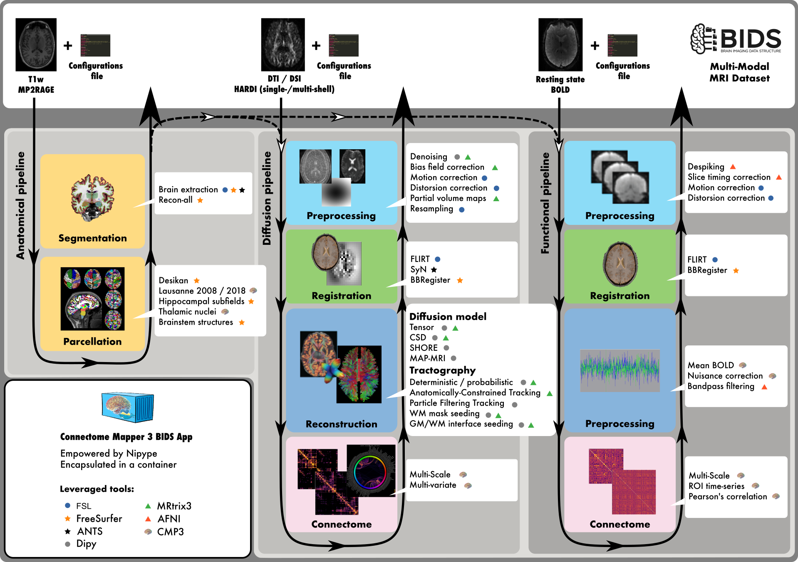
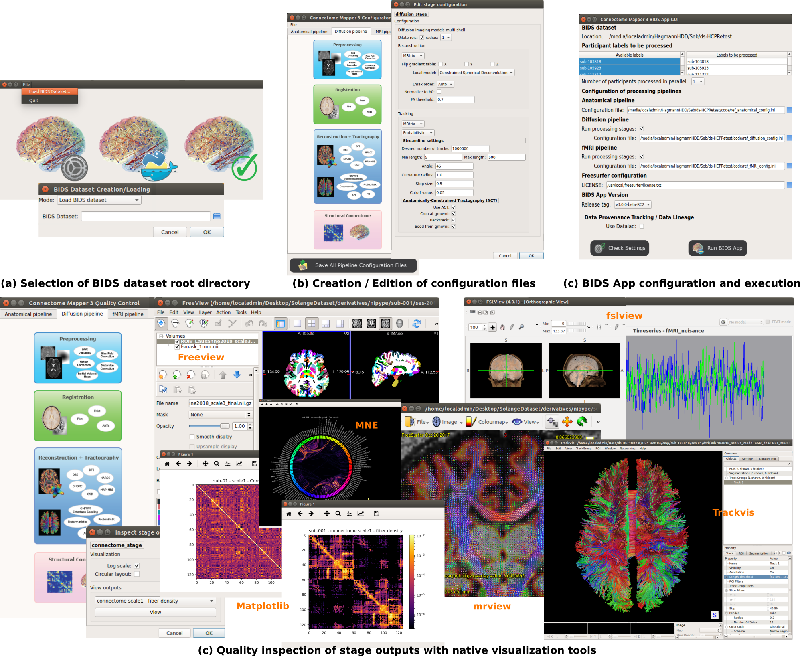
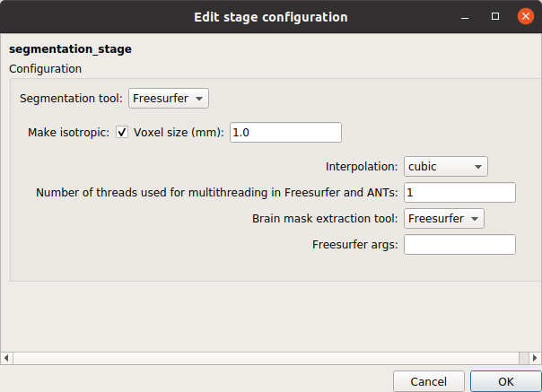
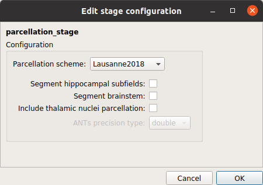
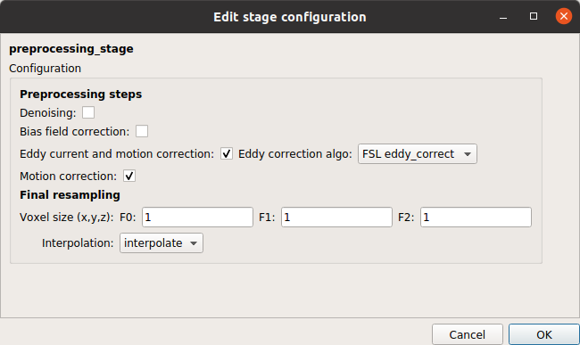
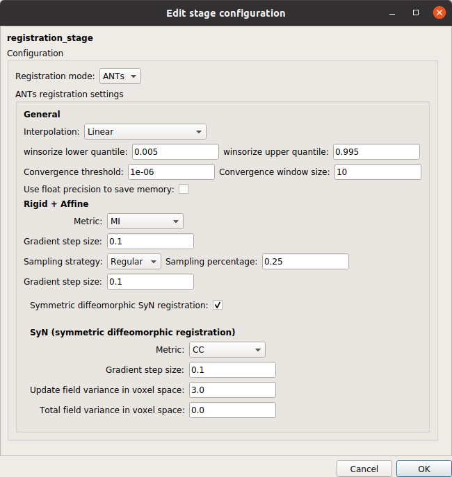
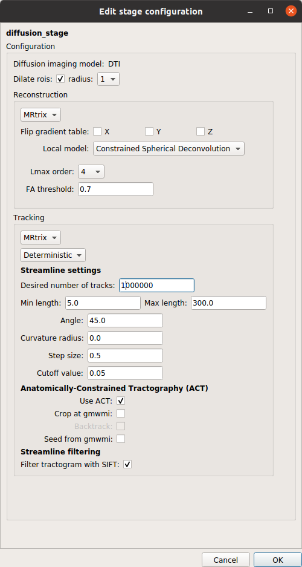
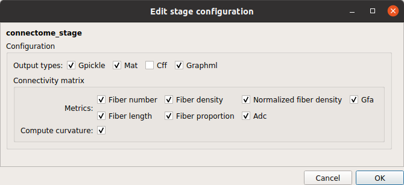

Hand over the stage to Sebastien.

- [Link (Under development)](../presentations/tutorial02/index.html) to slides.

> ## Prerequisites
>
> For best learning outcome, it is essential to have a basic understanding of:
> - Unix operating system, command line and shell
>
> If not, we recommend you to follow the lesson for the [unix shell](https://swcarpentry.github.io/shell-novice/) made by Software Carpentry.
>
> Although not essential it is also helpful to have an understanding of:
> - Which steps are involved in the process of structural human brain connectome mapping from anatomical and diffusion MRI
> - What a container image is
{: .prereq}

### Introduction

This tutorial illustrates a step-by-step guide to compute, in the BIDS ecosystem, from raw anatomical and diffusion MRI of the summerschool dataset, brain parcellation at multiple scales and the corresponding structural connectivity matrices, using a BIDS App, the Connectome Mapper 3.

> ## Tutorial outline
> - What is a BIDS App?
> - What is Connectome Mapper 3?
> - Generate the 5-scale Lausanne2018 brain parcellations and the brain structural connectivity matrices
{: .callout}

### What is a BIDS App?

*   Container image capturing a neuroimaging pipeline that takes a BIDS formatted dataset as input. BIDS Apps are constructed in a way that does not depend on any software outside of the image other than the container engine.

*   Followed a same core set of command line arguments, making the BIDS Apps easy to run and integrate into automated platforms
    
~~~
docker run -ti --rm \
  -v $HOME/data/ds005:/bids_dataset:ro \  # map dataset directory to the /bids_dataset location inside the container
  -v HOME/data/ds005/derivatives/example-0.0.4:/outputs \  # map output directory to the /outputs location inside the container
  bids/example:0.0.4 \  # BIDS App
  /bids_dataset /outputs participant --participant_label 01  # Core set of commandline arguments
~~~
{: .language-bash}

*   Versioned and all of the historical versions are available to download.

*   By reporting the BIDS App name and version in a manuscript, authors can provide others with the ability to exactly replicate their analysis workflow.

> ## External materials
> - **BIDS-Apps Website:** [https://bids-apps.neuroimaging.io](https://bids-apps.neuroimaging.io)
> - **Paper** Gorgolewski KJ, et al. (2017) "BIDS apps: Improving ease of use, accessibility, and reproducibility of neuroimaging data analysis methods". PLOS Computational Biology 13(3): e1005209. [https://doi.org/10.1371/journal.pcbi.1005209](https://doi.org/10.1371/journal.pcbi.1005209)
> - **Chris Gorgolewski's Workshop Video** [https://www.youtube.com/watch?v=wAATYzn8O54&ab_channel=ArielRokem](https://www.youtube.com/watch?v=wAATYzn8O54&ab_channel=ArielRokem)
{: .callout}

### What is Connectome Mapper 3?

[`Connectome Mapper 3 (CMP3)`](https://github.com/connectomicslab/connectomemapper3) is an open-source Python3 image processing pipeline software developed by the Connectomics Lab at the University Hospital of Lausanne (CHUV) for use within our SNF Sinergia Project, as well as for open-source software distribution.

CMP3 implements full anatomical, diffusion and resting-state MRI processing pipelines split into multiple stages, from raw Diffusion / T1 / T2 / BOLD data to multi-resolution connection matrices, distributed as a BIDS App.

CMP3 pipelines use a combination of tools from well-known software packages, including [FSL](https://fsl.fmrib.ox.ac.uk/fsl/fslwiki), [FreeSurfer](https://surfer.nmr.mgh.harvard.edu/fswiki/FreeSurferWiki), [ANTs](http://stnava.github.io/ANTs/), [MRtrix3](http://www.mrtrix.org/), [Dipy](https://nipy.org/dipy/) and [AFNI](https://afni.nimh.nih.gov/), orchestrated by the [Nipype](https://nipype.readthedocs.io/en/latest/) dataflow library. These pipelines can be easily updated as newer and better neuroimaging software become available.

    

*   The **Anatomical Pipeline** computes the different cortical parcellations from anatomical MRI data. It is composed of:

    *   **Segmentation stage** that performs brain tissue segmentation and cortical surface reconstruction with the help of FreeSurfer.

    *   **Parcellation stage** that performs brain parcellation based on a NativeFreeSurfer / Lausanne2008 / Lausanne2018 parcellation scheme.

*   The **Diffusion Pipeline** computes the different structural brain connectivity matrices from diffusion MRI data. It consists of:

    *   **Preprocessing stage** that can perform denoising, bias field correction, eddy current distorsion and motion correction, and resampling of the diffusion MRI data

    *   **Registration stage** that co-registers the anatomical MRI to the diffusion-free B0 image and project the brain parcellations to the (resampled) diffusion MRI space.

    *   **Diffusion stage** that performs (1) the reconstruction of the diffusion signal via Tensor or CSD models, and (2) the reconstruction of the fibers (tractography).

    *   **Connectome stage** that maps the reconstructed fibers to the different cortical parcels and build a number of different structural brain connectivity maps such as the number of fibers, the fiber density, the mean fiber length, etc...

*   The fMRI pipeline computes the different brain functional connectivity matrices based on the Pearson's correlation between time-series of the cortical parcels. It is composed of:

    *   **Preprocessing stage** that can perform despiking, slice-timing, eddy current distorsion, and motion correction

    *   **Registration stage** co-registers the anatomical MRI to the mean BOLD image and project the brain parcellations to the mean BOLD space.

    *   **fMRI processing stage** that can perform nuisance regression and bandpass filtering.

    *   **Connectome stage** that computes (1) the time-serie of each cortical parcels followed by (2) the Pearson's correlation between each cortical parcel time-serie.

<!-- Source: [https://connectome-mapper-3.readthedocs.io/en/latest/\_images/flowchart_bidsapp.png](https://connectome-mapper-3.readthedocs.io/en/latest/_images/flowchart_bidsapp.png) -->

CMP3 comes with a Graphical User Interface aka `cmpbidsappmanager`, designed to facilitate the configuration of all pipeline stages, the configuration of the BIDS App run, the generation of the command, and its execution, and the inspection of the different stage outputs with appropriate viewers.

    

For more documentation, please check the resources below.

> ## Resources
> - **Documentation:** [https://connectome-mapper-3.readthedocs.io](https://connectome-mapper-3.readthedocs.io)
> - **How to use `cmpbidsappmmanager`:** [https://connectome-mapper-3.readthedocs.io/en/latest/bidsappmanager.html](https://connectome-mapper-3.readthedocs.io/en/latest/bidsappmanager.html)
> - **How to use CMP3 BIDS App commandline interface:** [https://connectome-mapper-3.readthedocs.io/en/latest/usage.html](https://connectome-mapper-3.readthedocs.io/en/latest/usage.html)
{: .callout}

### Generate the 5-scale Lausanne2018 brain parcellations and the brain structural connectivity matrices

In this part of this tutorial, you will have exercises to learn not only how to configure the different pipelines and run CMP3 to produce the 5-scale Lausanne2018 brain parcellations and the structural brain connectivity matrices that will be used in the next tutorials, but also how to inspect the quality of the outputs of the different processing stages.

CMP3 is installed in the virtual machine provided for the summer school along with Docker, miniconda3 for the Python 3.7 environment and the following viewers:

* `freeview`: Viewer of FreeSurfer tool used to visualize FreeSurfer outputs of the segmentation stages and outputs of the parcellation stage. 

* `mrview`: Viewer of MRtrix3 used to visualize most of the diffusion pipeline outputs such as the preprocessed diffusion data, th estimated noise or the reconstructed fiber orientation distribution function (ODF) image.

* `trackvis`: Viewer to visualize the reconstructed fibers. 

* `fsleyes`: Viewer of FSL used to overlay images to support registration quality assessment and display a number of outputs of the fMRI pipeline

**Note:** You will need to provide your own license key at first use of `trackvis`. You can get one on the official [Download page](http://www.trackvis.org/download/). You will also need to provide your own Freesurfer license.txt in `$HOME/Softwares/freesurfer` directory to use both CMP3 and `freeview`. Please check the [FreeSurfer Download and Registration page](https://surfer.nmr.mgh.harvard.edu/registration.html) to obtain one.

In this exercise you will work through the configuration of CMP3 pipelines with `cmpbidsappmanager`.

> ## Exercise 1: Use `cmpbidsappmanager` to configure the anatomical and diffusion pipelines (click on the arrow to open)
> 1. Open a terminal and launch `cmpbidsappmanager`
> 2. Load the summerschool dataset that in located in `$HOME/Data/ds003505`
> 3. Open the Configurator Window
> 4. Configure the different stages as follows:
>
> **ANATOMICAL PIPELINE**
>
> **Segmentation stage**
>
> 

>     
> 

> 
> **Parcellation stage**
>
> 

>     
> 

>
> **DIFFUSION PIPELINE**
>
> **Preprocessing stage**
>
> 

>     
> 

>
> **Registration stage**
>
> 

>     
> 

>
> **Diffusion reconstruction and tractography stage**
>
> 

>     
> 

>
> **Connectome stage**
>
> 

>     
> 

>
>
> 5. When you are done, save all configuration files
>
> > ## Solution (click on the arrow to open)
> >
> > We have made the pipeline configuration file solutions available:
> >
> > 1. Download the [Anatomical Pipeline Configuration file]({{site.root}}/data/ref_anatomical_config.json)
> > 2. Download the [Diffusion Pipeline Configuration file]({{site.root}}/data/ref_diffusion_config.json)
> {: .solution}
{: .challenge}

In this exercise you will work through the configuration and execution of the BIDSApp of CMP3 with `cmpbidsappmanager`.

> ## Exercise 2: Use `cmpbidsappmanager` to run the BIDSApp (click on the arrow to open)
> 1. If `cmpbidsappmanager` is not started, launch `cmpbidsappmanager` and load the summerschool dataset as in the previous exercise
> 2. Open the BIDS App Window
> 3. Select to process `sub-01` and control that the configuration files are pointing to  `$HOME/Data/ds003505/code/ref_anatomical_config.json` and `$HOME/Data/ds003505/code/ref_diffusion_config.json`
> 4. Check the run configuration and run the BIDS App
{: .challenge}

In this exercise you will work through the configuration of CMP3 pipelines with `cmpbidsappmanager`.

> ## Exercise 3: Use `cmpbidsappmanager` to check pipeline outputs with external viewers (click on the arrow to open)
> 1. If `cmpbidsappmanager` is not started, launch `cmpbidsappmanager` and load the summerschool dataset as in the previous exercise
> 2. Open the Quality Inspector Window
> 3. Select the subject `sub-01` 
> 4. Check the the parcellations co-registered to the resampled diffusion-free B0 volume
> 5. Check the fiber orientation distribution function (ODF) image reconstructed by CSD
> 6. Check the tractogram (the reconstructed fibers)
> 7. Visualize the connectivity matrices
{: .challenge}

In this exercise you will have to reproduce the execution of the BIDS App via `cmpbidsappmanager` using directly its commandline interface.

> ## Exercise 4: Run directly the BIDSApp commandline interface (click on the arrow to open)
> Hint: In the last exercise, `cmpbidsappmanager` displayed the generated command in the terminal output when running the BIDS App.
>
> > ## Solution (click on the arrow to open)
> >
> > The command should be:
> >
> > ~~~
> > docker run -it --rm \
> > -v $HOME/Data/ds003505:/bids_dir \
> > -v $HOME/Data/ds003505/derivatives:/output_dir \
> > -v $HOME/Softwares/freesurfer/license.txt:/bids_dir/code/license.txt \
> > -v $HOME/Data/ds003505/code/ref_anatomical_config.json:/code/ref_anatomical_config.json \
> > -v $HOME/Data/ds003505/code/ref_diffusion_config.json:/code/ref_diffusion_config.json \
> > -u "$(id -u)":"$(id -g)" \
> > sebastientourbier/connectomemapper-bidsapp:v3.0.0-RC4 \  # CMP BIDS App Docker image
> > /bids_dir /output_dir participant --participant_label 01 \  # BIDS App argument sets
> > --anat_pipeline_config /code/ref_anatomical_config.json \
> > --dwi_pipeline_config /code/ref_diffusion_config.json \
> > --fs_license /bids_dir/code/license.txt
> > ~~~
> > {: .language-bash}
> {: .solution}
{: .challenge}
