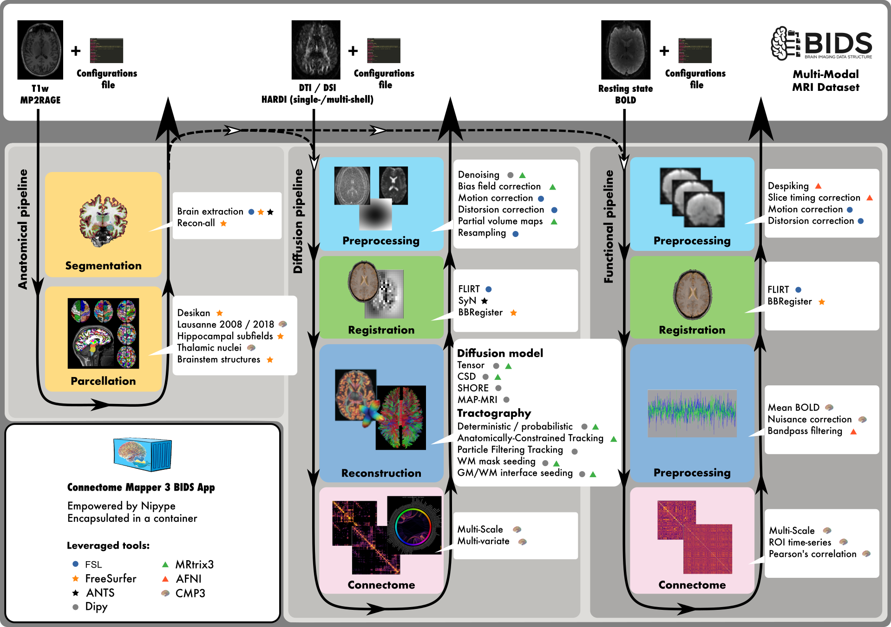
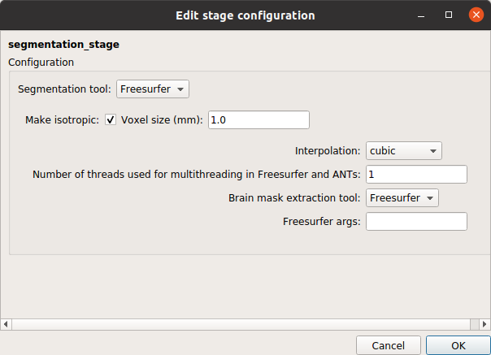
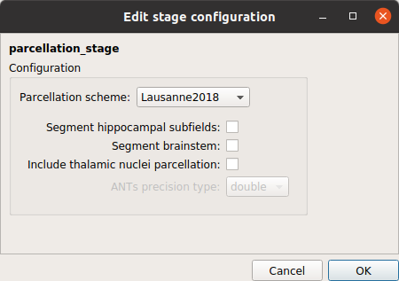
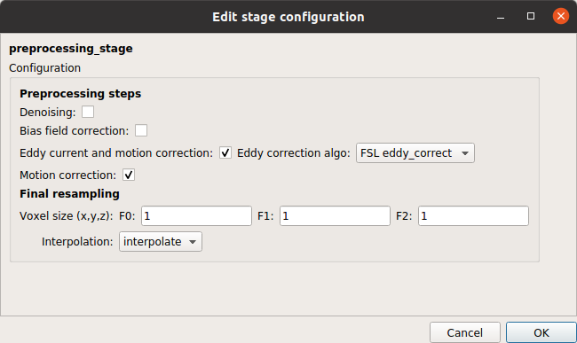
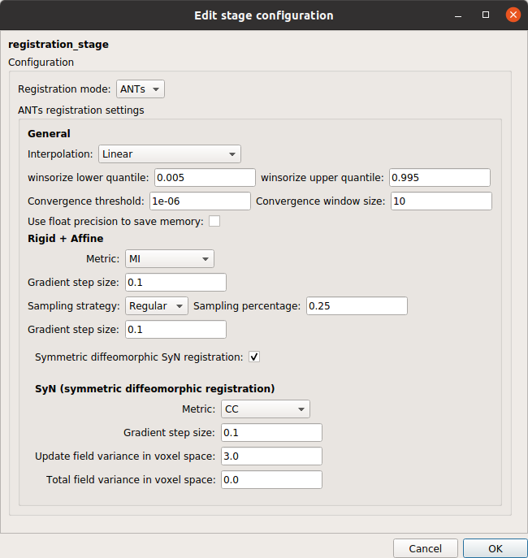
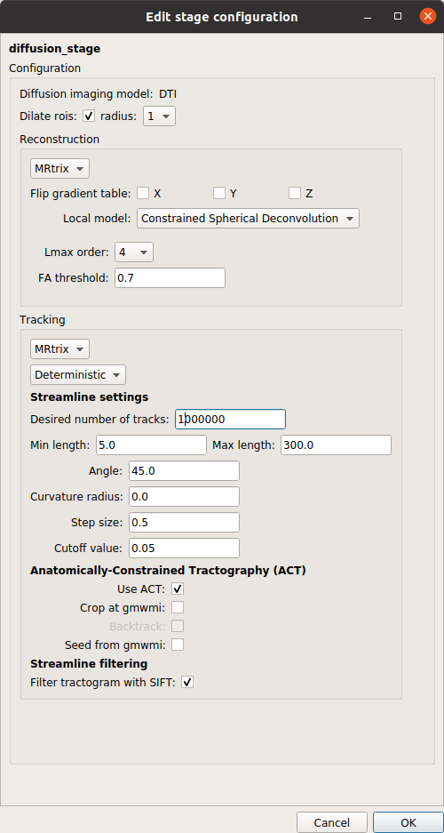
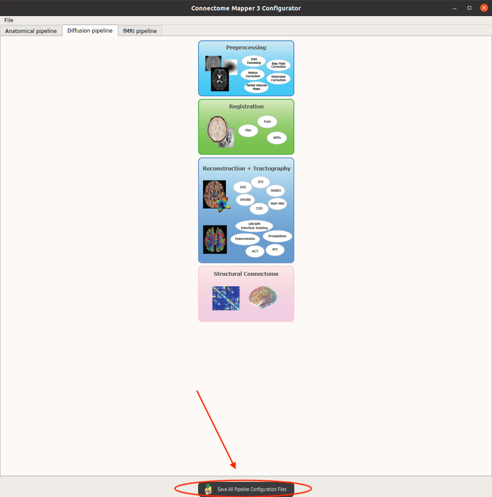
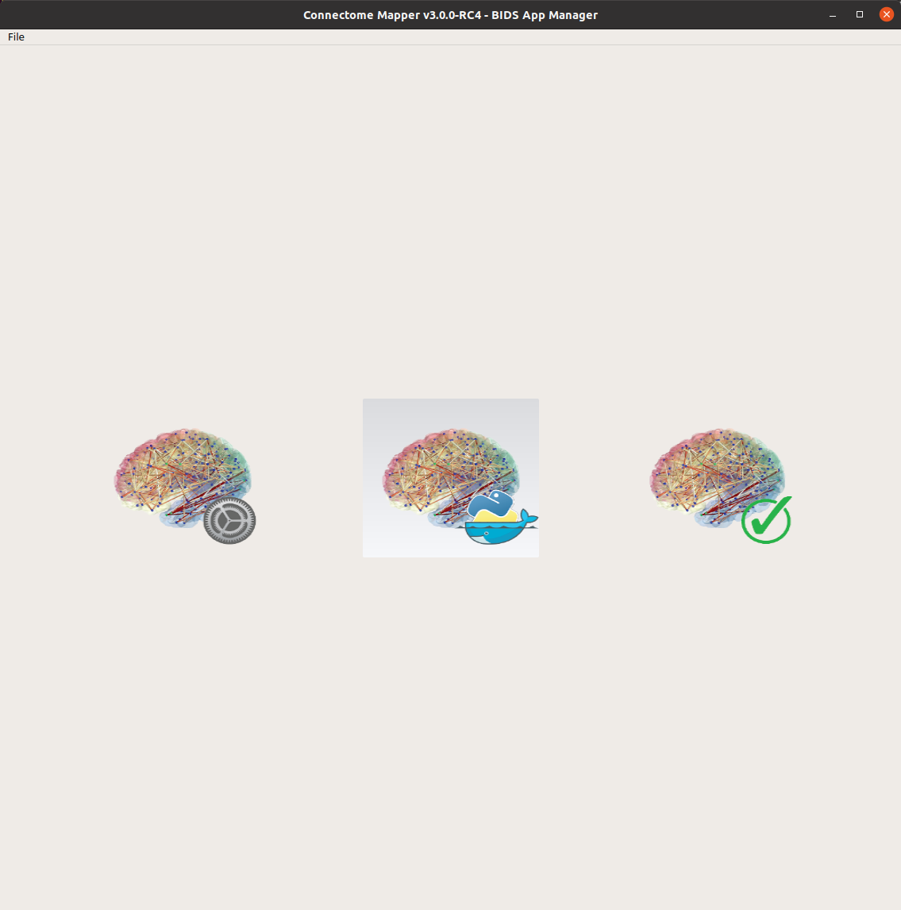
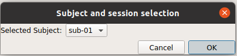
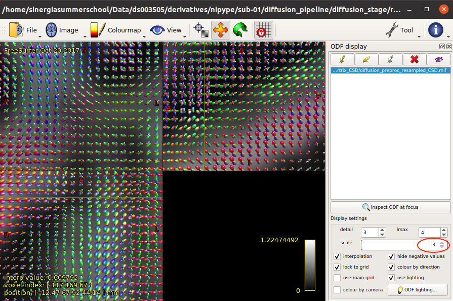

name: inverse
layout: true
class: center, middle, inverse

---

# Tutorial 02: Anatomical and Diffusion <br>MRI Pipelines

### sebastien.tourbier@alumni.epfl.ch  |  CC-BY

.footer[<br><br>]

---

class: middle
layout: false

## Tutorial outline

- What is a BIDS App?

- What is Connectome Mapper 3 (CMP3)?

- Generate the brain parcellations and the structural connectivity matrices with CMP3

---

class: middle

## What is a BIDS App?

- Container image capturing a neuroimaging pipeline that takes a BIDS formatted dataset as input. BIDS Apps are constructed in a way that does not depend on any software outside of the image other than the container engine.

- Followed a same core set of command line arguments
    
    ```bash
    docker run -ti --rm \
      -v $HOME/data/ds005:/bids_dataset:ro \  # map dataset directory to the /bids_dataset location inside the container
      -v HOME/data/ds005/derivatives/example-0.0.4:/outputs \  # map output directory to the /outputs location inside the container
      bids/example:0.0.4 \  # BIDS App
      /bids_dataset /outputs participant --participant_label 01  # Core set of commandline arguments
    ```

- Versioned and all of the historical versions are available to download.

<p>
    <a style="color:dodgerblue;">&rarr;</a> BIDS Apps easy to be run and integrated into automated platforms<br><br>
    <a style="color:dodgerblue;">&rarr;</a> Authors can provide others with the ability to exactly replicate their analysis workflow by reporting the BIDS App name and version in a manuscript.
</p>

---

class: middle

## What is a BIDS App?

For more information, please check the resources below:

- **BIDS-Apps Website:** [https://bids-apps.neuroimaging.io](https://bids-apps.neuroimaging.io)

- **Paper** Gorgolewski KJ, et al. (2017) "BIDS apps: Improving ease of use, accessibility, and reproducibility of neuroimaging data analysis methods". PLOS Computational Biology 13(3): e1005209. [https://doi.org/10.1371/journal.pcbi.1005209](https://doi.org/10.1371/journal.pcbi.1005209)

- **Chris Gorgolewski's Workshop at Neurohackweek** [https://www.youtube.com/watch?v=wAATYzn8O54&ab_channel=ArielRokem](https://www.youtube.com/watch?v=wAATYzn8O54&ab_channel=ArielRokem)

---

class: middle

## What is Connectome Mapper 3?

- Open-source Python project that implements full anatomical, diffusion and resting-state MRI processing pipelines, from raw Diffusion / T1 / T2 / BOLD data, organized accordingly to the BIDS standard, to multi-resolution connection matrices.

<p style="text-align: center">
    
</p>

---

class: middle

## What is Connectome Mapper 3?

- Distributed as a BIDS App to promote reusability, reproducibility and replicatibility

    ```bash
    $ docker run -it --rm \
     -v "/local/path/to/bids/dataset":"/bids_dir" \
     -v "/local/path/to/output/directory":"/output_dir" \
     -v "/local/path/to/freesurfer/license.txt":"/bids_dir/code/license.txt" \
     sebastientourbier/connectomemapper-bidsapp \
     "/bids_dir" "/output_dir" participant --participant_label "01" \
     --anat_pipeline_config "/code/ref_anatomical_config.json" \
     --dwi_pipeline_config "/code/ref_diffusion_config.json" \
     --fs_license "/bids_dir/code/license.txt"
    ```

---

class: middle

## What is Connectome Mapper 3 (CMP3)?

- Come with a Graphical User Interface aka `cmpbidsappmanager`, designed to facilitate all steps involved in the configuration and execution of CMP3:

<p style="text-align: center">
    
</p>

---

class: middle

## What is Connectome Mapper 3?

For more documentation, please check the resources below.

- **Documentation:** [https://connectome-mapper-3.readthedocs.io](https://connectome-mapper-3.readthedocs.io)
- **How to use `cmpbidsappmmanager`:** [https://connectome-mapper-3.readthedocs.io/en/latest/bidsappmanager.html](https://connectome-mapper-3.readthedocs.io/en/latest/bidsappmanager.html)
- **How to use CMP3 BIDS App commandline interface:** [https://connectome-mapper-3.readthedocs.io/en/latest/usage.html](https://connectome-mapper-3.readthedocs.io/en/latest/usage.html)

---

class: middle

## Generate the brain parcellations and the structural connectivity matrices with CMP3

*Setup*

- In this tutorial, we will be using CMP3 on the summerschool `VEPCON` sample dataset. The data comes
  preloaded in the virtual machine of the summer school.

- If you want to follow along, please check that you have the virtual machine (VM) of the summer school running.

---

class: middle

## Exercise 1: Use cmpbidsappmanager to configure the pipelines 

Learn how to configure the anatomical and diffusion pipelines and create their configuration files with `cmpbidsappmanager`

---

class: middle

## Launch cmpbidsappmanager

- Open a terminal and launch `cmpbidsmanager`:
```
cmpbidsappmanager
```

---

class: middle

## Load the summerschool dataset

- Click `File > Load BIDS dataset...` in the main window and load the summerschool dataset that in located in `$HOME/Data/ds003505`

<p style="text-align: center">
    
</p>

---

class: middle

## Open the configurator window

- Click on the left button of the main window of `cmpbidsappmanager` to open the configurator window

<p style="text-align: center">
    
</p>

---

class: middle

## Configure the anatomical pipeline

- Configure the segmentation stage as follows:

<p style="text-align: center">
    
</p>

---

class: middle

## Configure the anatomical pipeline

- Configure the parcellation stage as follows:

<p style="text-align: center">
    
</p>

---

class: middle

## Configure the diffusion pipeline

- Configure the preprocessing stage as follows:

<p style="text-align: center">
    
</p>

---

class: middle

## Configure the diffusion pipeline

- Configure the registration stage as follows:

<p style="text-align: center">
    
</p>

---

class: middle

## Configure the diffusion pipeline

- Configure the diffusion reconstruction and tractography stage as follows:

<p style="text-align: center">
    
</p>

---

class: middle

## Configure the diffusion pipeline

- Configure the connectome stage as follows:

<p style="text-align: center">
    
</p>

---

class: middle

## Save the pipeline configuration files

- Click on the "Save All Pipeline Configuration Files" button

<p style="text-align: center">
    
</p>

- You can close the window

---

class: middle

## Exercise 2: Use cmpbidsappmanager to run the BIDSApp

Learn how to configure and execute the BIDS App with `cmpbidsappmanager`

---

class: middle

## Open the BIDS App window

- Click on the middle button of the main window of `cmpbidsappmanager` to open the BIDS App window

<p style="text-align: center">
    
</p>

---

class: middle

## Configure the BIDS App execution

- Select to process `sub-01`

- Control that the configuration files are pointing to  `$HOME/Data/ds003505/code/ref_anatomical_config.json` and `$HOME/Data/ds003505/code/ref_diffusion_config.json`, created in Exercise 1

- Click on the `Check Settings` button to verify the configuration

<p style="text-align: center">
    
</p>

---

class: middle

## Execute the BIDS App

- Click on the `Run BIDS App` button to execute the BIDS App

<p style="text-align: center">
    
</p>

---

class: middle

## Execute the BIDS App

- You can see the docker run command genertated in the main output in the terminal

<p style="text-align: center">
    
</p>

- An execution log is written to `derivatives/cmp/sub-01/sub-01_log.txt`
    ```
    glogg $HOME/Data/ds003505/derivatives/cmp/sub-01/sub-01_log.txt
    ```

- Once completed, you can close the window

---

class: middle

## Exercise 3: Use cmpbidsappmanager to check pipeline outputs with external viewers

Learn how to inspect the quality of the different stage outputs

---

class: middle

## Open the quality inspector window

- Click on the right button of the main window of `cmpbidsappmanager` to open the quality inspector window

<p style="text-align: center">
    
</p>

---

class: middle

## Select to view outputs for sub-01

- Select `sub-01` from the list

<p style="text-align: center">
    
</p>

---

class: middle

## Check the parcellations co-registered to the diffusion volume

- In `Diffusion Pipeline > Registration Stage`, you can view the parcellations co-registered to the resampled diffusion-free B0 volume

<p style="text-align: center">
    
</p>

---

class: middle

## Check the fiber orientation distribution function (ODF) image reconstructed by CSD

- In `Diffusion Pipeline > Diffusion Stage`, you can view `SH image` i.e. the fiber orientation distribution function (ODF) image reconstructed by CSD

<p style="text-align: center">
    
</p>

---

class: middle

## Check the fiber orientation distribution function (ODF) image reconstructed by CSD

- Customize the rendering of the orientation distribution functions by going to `Tools > ODF display`

<p style="text-align: center">
    
</p>

- Press the `Ctrl + "+"` / `Ctrl + "-"` shortcuts to zoom in / out a region

---

class: middle

## Check the tractogram

- In `Diffusion Pipeline > Connectome Stage`, you can view `final tractogram` (the reconstructed fibers used in the connectivity matrices)

<p style="text-align: center">
    
</p>

---

class: middle

## Check the tractogram

- To display all fibers in `trackvis`, disable the "Y" axis in `Property > Track > Slice Filters` 

<p style="text-align: center">
    
</p>

---

class: middle

## Visualize the connectivity matrices

- In `Diffusion Pipeline > Connectome Stage`, you can view the connectivity matrices for the different measures and the 5 scales of Lausanne 2018 parcellation scheme in a standard or circular layout

<p style="text-align: center">
    <table border="0" style="margin-left: auto; margin-right: auto;">
        <tr>
            <td></td>
            <td></td>
        </tr>
    </table>
    
</p>

- Once completed, you can close all the windows.

---

class: middle

## Exercise 4: Run directly the BIDSApp commandline interface

Learn how to run directly the BIDSApp commandline interface of CMP3

---

class: middle

## Run the BIDSApp commandline interface of CMP3

- In a terminal, run the following command:
```bash
$ export BIDS_DIR="/home/sinergiasummerschool/Data/ds003505"
$ docker run -it --rm \
 -v "$BIDS_DIR":"/bids_dir" \
 -v "$BIDS_DIR/derivatives":"/output_dir" \
 -v "$HOME/Softwares/freesurfer/license.txt":"/bids_dir/code/license.txt" \
 -v "$BIDS_DIR/code/ref_anatomical_config.json":"/code/ref_anatomical_config.json" \
 -v "$BIDS_DIR/code/ref_diffusion_config.json":"/code/ref_diffusion_config.json" \
 -u "$(id -u)":"$(id -g)" \
 sebastientourbier/connectomemapper-bidsapp:v3.0.0-RC4 \
 "/bids_dir" "/output_dir" participant --participant_label "01" \
 --anat_pipeline_config "/code/ref_anatomical_config.json" \
 --dwi_pipeline_config "/code/ref_diffusion_config.json" \
 --fs_license "/bids_dir/code/license.txt"
```
---

class: middle

# Questions?

If something is unclear, or you would like to contribute to this tutorial, please open an issue or pull request on our [Github repo](https://github.com/sinergia-connectomics-summerschool-2021/scss21-training)
